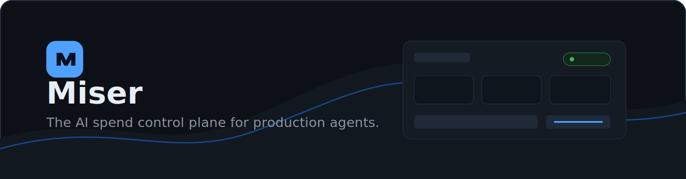
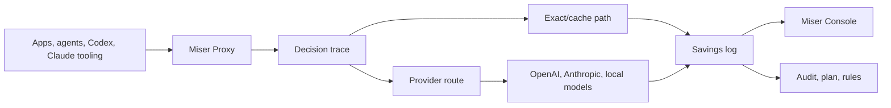

<p align="center">
  
</p>

<p align="center">
  <a href="https://github.com/Miser-Source/miser/actions/workflows/ci.yml"></a>
  <a href="LICENSE"></a>
  
  
  
  
</p>

<p align="center">
  
  
  
  
</p>

<p align="center"><em>The AI spend control plane for production agents.</em></p>

## Overview

Miser is an open-source runtime and CLI for finding, explaining, and reducing wasted LLM spend.

It can audit historical logs, reconcile usage against actual invoices, and run as an OpenAI-compatible proxy with a browser console. The goal is not to make another dashboard. The goal is to put Miser in the request path so teams can see every expensive AI call, understand the decision Miser made, and prove exactly how much money was saved.

Miser is built around one principle:

```text
Turn repeated AI work into cheaper software.
```

That can mean exact cache, semantic cache, prompt/context compression, cheaper model routing, local-model fallback, deterministic rules, or generated workflow patches.

## Features

- Live proxy at `/v1` for **OpenAI** (`/v1/chat/completions`, `/v1/responses`) and **Claude / Anthropic** (`/v1/messages`)
- Switch provider and connect API keys at runtime from the browser console — no restart needed
- Individual and business profiles: workspace naming and a soft monthly budget with live `X-Miser-Budget` headers
- Browser console with chat playground, decision trace, request inspector, and live savings metrics
- Exact response cache for repeated non-streaming chat/responses/messages calls
- JSONL audit for LLM calls, provider usage rows, invoices, and coding-agent aggregates
- OpenAI organization usage/cost pullers
- `ccusage` import for Claude Code and coding-agent spend analysis
- Dynamic published pricing for known OpenAI and Claude models
- Actual invoice reconciliation so audits can use real spend, not only token estimates
- Account and integration filtering for multi-account setups
- Agent rule generation for Codex, Claude, and generic workflows
- Policy-as-code artifacts for context replay, handoffs, quality guardrails, and savings tracking

## Who Is Miser For?

Miser is for teams whose AI usage has moved beyond experiments.

It is a good fit if you:

- Spend real money on Claude, OpenAI, Gemini, local models, or agentic workflows
- Need to prove where AI spend is going by account, integration, model, and workflow
- Want to route easy work away from expensive frontier models without losing quality
- Need a human-readable trace for every cache, routing, compression, or pass-through decision
- Want policy-as-code instead of a dashboard that only complains after the bill arrives

Miser is probably not worth it if your AI bill is tiny or your app only makes occasional one-off calls.

## How It Works



## Quick Start

### Build

```bash
go build -o bin/miser ./cmd/miser
go test ./cmd/... ./internal/...
```

### Run The Live Proxy (Individuals)

The fastest path: start the proxy with no key and connect a provider from the browser.

```bash
bin/miser proxy --addr 127.0.0.1:8788
```

Open `http://127.0.0.1:8788`, pick **OpenAI** or **Claude** in the setup terminal, and paste your API key. Keys are held in memory only — never written to logs or disk. You can also pre-set `OPENAI_API_KEY` or `ANTHROPIC_API_KEY` and skip the gate:

```bash
export ANTHROPIC_API_KEY=...
bin/miser proxy --provider anthropic --addr 127.0.0.1:8788
```

Point any OpenAI-compatible client at `http://127.0.0.1:8788/v1`, or any Anthropic client (`/v1/messages`) at the same address when running in Claude mode. Provider can be switched at runtime from the console — no restart.

### Run The Live Proxy (Teams & Businesses)

Business mode adds a workspace label and a **soft monthly budget**. Miser tracks month-to-date spend across restarts (seeded from the proxy log) and stamps every proxied response with `X-Miser-Budget: <spend>/<budget>` and `X-Miser-Budget-Status: ok|exceeded`. Miser warns — it never blocks traffic.

```bash
bin/miser proxy \
  --provider anthropic \
  --mode business \
  --workspace "Acme Inc" \
  --budget 500 \
  --account acme-prod \
  --integration support-bot \
  --log .miser/proxy-logs.jsonl \
  --cache .miser/exact-cache.json
```

The console shows the workspace next to the proxy status and a live budget bar in the inspector. Use `--account` and `--integration` to attribute spend per team or product, then slice audits with the same flags. Profile and budget can also be updated at runtime via `POST /miser/api/profile`.

Rollout checklist for teams:

1. Run one proxy per provider account (or per team) with distinct `--account` labels.
2. Keep `--store-prompts` off (the default) so no prompt text is retained.
3. Set `--budget` to the monthly cap you want alerted on.
4. Ship `.miser/proxy-logs.jsonl` into `miser audit` weekly for savings reports.

The console shows:

- original request metadata
- model requested
- Miser action: pass-through, cache write, or exact cache hit
- final provider route
- cost after Miser
- estimated saved cost
- latency, token counts, cache status, and cost basis

### Audit Intercepted Traffic

```bash
bin/miser audit --explain \
  --account openai-personal \
  --integration codex \
  .miser/proxy-logs.jsonl
```

## Audit Existing Logs

Miser expects newline-delimited JSON:

```json
{
  "id": "call_001",
  "timestamp": "2026-06-01T12:00:00Z",
  "workflow": "support_ticket_summary",
  "provider": "anthropic",
  "model": "claude-3-5-sonnet",
  "prompt": "Summarize this support ticket...",
  "input_tokens": 2100,
  "output_tokens": 340,
  "cost_usd": 0.0124,
  "account_id": "claude-work",
  "integration": "claude",
  "cost_basis": "reported_log_cost",
  "latency_ms": 4810,
  "quality_score": 0.98
}
```

Run:

```bash
bin/miser audit examples/llm_calls.jsonl
bin/miser audit --explain examples/llm_calls.jsonl
```

Example output:

```text
Miser AI Spend Audit

Monthly spend analyzed: $0.44
Cost basis: reported log cost
Estimated avoidable spend: $0.36
Savings opportunity: 80.6%

Top waste:
1. Duplicate summaries: $0.16 (80% workflow savings potential)
2. Repeated long-context calls: $0.07 (55% workflow savings potential)
3. Oversized PDF prompts: $0.06 (60% workflow savings potential)
4. Expensive model used for classification: $0.04 (70% workflow savings potential)
5. Agent retry loops: $0.04 (85% workflow savings potential)
```

## Plans And Rules

`plan` turns audit findings into an executable savings plan:

```bash
bin/miser plan --out miser-plan.yaml logs.jsonl
```

`rules` turns the plan into policy a team can review and enforce:

```bash
bin/miser rules \
  --target codex \
  --out .miser/agent-rules.yaml \
  --instructions .miser/AGENT_RULES.md \
  logs.jsonl
```

Apply generated integration files:

```bash
bin/miser apply --target codex .miser/agent-rules.yaml
```

That writes policy artifacts for context replay control, session handoffs, replay evals, and savings metrics.

## Actual Spend And Cost Basis

Miser keeps estimated usage separate from real money.

Cost basis values:

- `actual_invoice`: billing export or invoice data
- `provider_billing_api`: provider billing API data
- `actual_invoice_allocated`: actual invoice dollars allocated across usage rows
- `reported_log_cost`: cost reported by request logs
- `published_token_price`: token usage priced from a known model catalog
- `estimated_token_cost`: estimated token/API value, not an invoice
- `unpriced_token_usage`: token usage for a model Miser does not know yet
- `miser_exact_cache`: request served by Miser cache with zero provider spend

Pull OpenAI costs:

```bash
export OPENAI_ADMIN_KEY=...

bin/miser pull openai \
  --from 2026-06-01 \
  --to 2026-07-01 \
  --out work/openai_bill.jsonl \
  --account codex-work \
  --integration codex
```

Pull OpenAI usage when costs are unavailable or covered by credits:

```bash
bin/miser pull openai-usage \
  --from 2026-06-01 \
  --to 2026-07-01 \
  --out work/openai_usage.jsonl \
  --account codex-work \
  --integration codex
```

Reconcile usage to actual invoice spend:

```bash
bin/miser reconcile work/openai_usage.jsonl \
  --actual-spend 10.00 \
  --out work/openai_actual_usage.jsonl \
  --account openai-personal \
  --integration codex
```

## Claude And Codex

Claude is supported **live**: run `miser proxy --provider anthropic` (or switch to Claude in the console) and point any Anthropic SDK/client at `http://127.0.0.1:8788`. The proxy injects `x-api-key` and `anthropic-version`, exact-caches repeated `/v1/messages` calls, and prices Claude 4.x/3.x models from the published catalog — including prompt-cache reads.

Miser also supports Claude/Codex analysis through imported usage and logs.

For Claude Code or coding-agent aggregate usage:

```bash
npx ccusage@latest daily --json > ccusage.json
bin/miser import ccusage ccusage.json --out logs.jsonl --account claude-work --integration claude
bin/miser audit --explain --account claude-work --integration claude logs.jsonl
```

Claude billing pull is not automatic yet. Import an invoice CSV for exact Claude spend.


The high-savings workflows usually come from stacking cheaper paths:

1. Compress context
2. Cache repeated work
3. Route easy cases to smaller models
4. Use local models where quality is good enough
5. Replace stable LLM calls with deterministic code
6. Keep frontier fallback for hard or ambiguous cases

## Documentation

- [Architecture](docs/architecture.md)
- [Roadmap](docs/roadmap.md)
- [Changelog](CHANGELOG.md)
- [Contributing](CONTRIBUTING.md)
- [Security](SECURITY.md)

## Frequently Asked Questions

**Is Miser a dashboard?**

No. Miser has a dashboard, but the important piece is the proxy/runtime layer. It can sit in the request path and log decisions before money is spent.

**Does Miser replace OpenAI or Claude?**

No. Miser routes to providers. It is a control plane between apps/agents and model providers.

**Can Miser use actual invoices?**

Yes. It can import invoices and reconcile usage rows to actual invoice spend so reports can show real money, not just token estimates.

**Does the proxy store prompts?**

Not by default. Proxy logs store fingerprints and metadata. Use `--store-prompts` only when you are allowed to retain prompt text.

## Community

Open issues for bugs, integration requests, and feature ideas.

Security-sensitive reports should not be posted publicly. See [SECURITY.md](SECURITY.md).

## License

Miser is licensed under the Apache License 2.0. See [LICENSE](LICENSE).

## Star History

<a href="https://star-history.com/#Miser-Source/miser&Date">
 <picture>
   <source media="(prefers-color-scheme: dark)" srcset="https://api.star-history.com/svg?repos=Miser-Source/miser&type=Date&theme=dark" />
   <source media="(prefers-color-scheme: light)" srcset="https://api.star-history.com/svg?repos=Miser-Source/miser&type=Date" />
   
 </picture>
</a>
